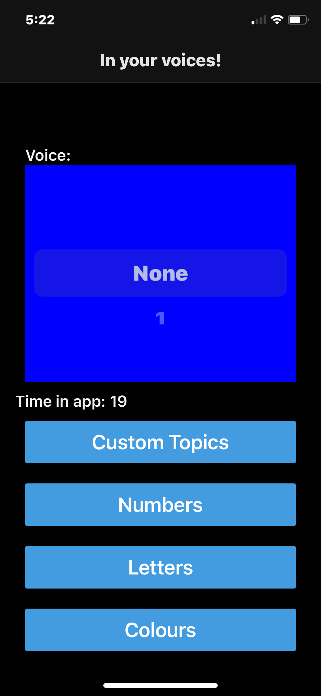

# In Your Voices

An IOS app that helps you teach your child with your voices using custom and built in flash cards.
[Documentation](https://willtp87.github.io/in-your-voices/)

## App Docs

* [Numbers](./docs/numbers.md)
* [Letters](./docs/letters.md)
* [Colours](./docs/colours.md)
* [Shapes](./docs/shapes.md)
* [Custom Topics](./docs/playCustomTopics.md)
* [Configuration](./docs/config.md)
  * [Voices](./docs/voices.md)
  * [Create Custom Topics](./docs/createCustomTopics.md)

### Data Export

The data stored in this app may be of great sentimental value. It can be exported by accessing the files through normal means:

* macOS: finder
* Windows: itunes
* linux: libimobiledevice

## Contribute

This is an open source project you can help develop it or contribute to [Patreon](https://www.patreon.com/WilliamPanting).

## Disclaimer

This app was built to help one family. Its author is a software developer and not a child educator.

## Alternatives

* [Toniebox](https://tonies.com/en-eu/tonieboxes/)
* [Yoto Players](https://ca.yotoplay.com/)

## Maintainers

* [William Panting](https://github.com/willtp87)

## Development

If you would like to contribute to this repo create an issue or pull request.

### Frameworks and Libraries

* [Expo](https://expo.dev/)
* [Expo Router](https://docs.expo.dev/router/introduction/)
* [React Native Elements](https://reactnativeelements.com/docs)
* [i18next](https://www.i18next.com/)
* [Redux Toolkit](https://redux-toolkit.js.org/)

### Building

A script to build for IOS on macos is provide in the package.json.
package.json scripts and vscode tasks for starting the Metro Bundler for use with Expo Go are provided.

### Debugging

A vscode launch file to attach the debugger to Expo Go is provided.

### Static Analysis

This project uses typescript and eslint with associated scripts.

* package.json
* github workflows
* vscode tasks

### Testing

This project uses Jest and has associated scripts.

* package.json
* github workflows
* vscode tasks

## Privacy

[Policy](./docs/privacyPolicy.md)

## License

[GPLv3](http://www.gnu.org/licenses/gpl-3.0.txt)
