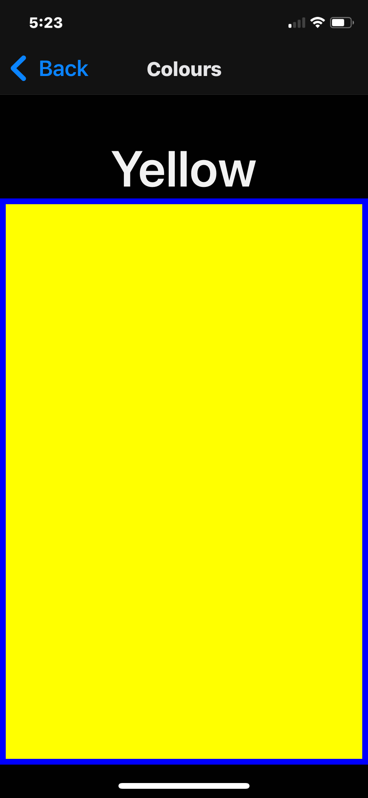

# Colours

The colours screen cicyles through a basic set of colours and then restarts.
For each colour it shows:

* the name of the colour
* a box of the colour
  * with a blue border for visiblilty

